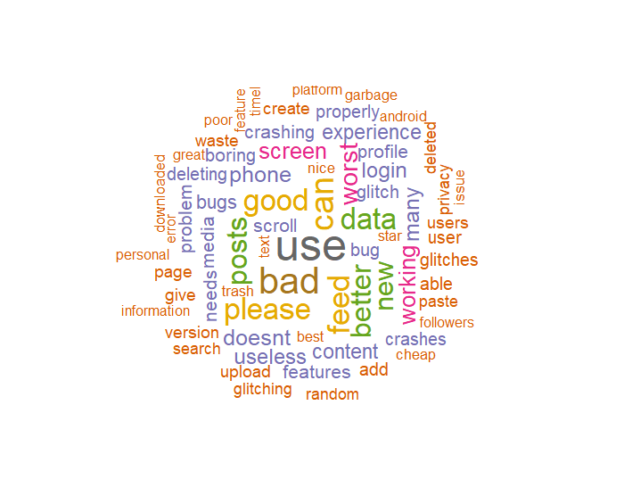
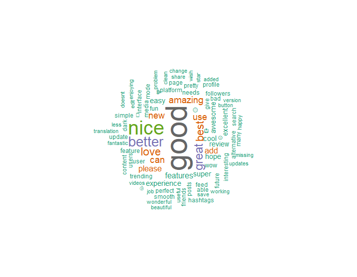
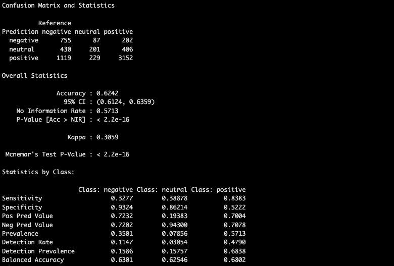

# Data Projects
Repository for some of my data projects, all coded in R. The following file describes my analysis of the same, while the actual code can be found in their respective folders.

# (1) Spotify Top Songs Analysis

I'm sure a lot of us have thought about what it would take to make a hit song. Song attributes can enable us to get an idea of just what makes our favorite tracks stand out. The analysis here attempts to predict the popularity of a song based on attributes such as 'danceability', 'energy', etc, as well as give us some insights based on genre and time of release.

### Broad Insights:

One of the best ways to begin is to analyze the popularity of different genres (note - there are many, many more genres than just these 10, but these were selected for being the most popular to make the graph more readable: 

As expected, we see pop songs have the highest popularity (it's in the name, right?), though the slope of the ridge is not very steep, indicating fair variance amongst different levels of popularity. Following a similar trend are hip-hop, dance, and indie-pop (though indie-pop has a fair distribution of songs with quite low popularity as well).

On a separate topic, the year of release also does have an impact on its popularity. This would make sense as with Spotify still growing in terms of its number of users, more and more people are likely to stream newer songs that at the time of course have a surge in popularity.

We can see a clear linear relationship between year and popularity. The slope of the line is _, indicating _.

### Regression Models and Predictions

Moving on from these broader insights, I want to see if we can build a predictive model to estimate the popularity of a song based on the internal song attributes. Rather than genre or year, the predictors describe the nature of the song itself in 12 ways: 'danceability', 'energy', 'loudness', 'speechiness', 'acousticness', 'instrumentalness', 'liveness', 'valence', 'tempo', 'duration_ms'.

To begin with, it seemed to me that there could be a degree of high multicollinearity between the predictor variables. I used the Variance Inflation Factor (VIF) method to test for this. 

The VIF values are not all that high. I was expecting to take action if they exceeded 5. Only two predictors come close to that, 'energy' and 'loudness'. Charting a correlation plot from a correlation matrix, we can see that 'energy' and 'loudness' have a fair degree of positive correlation with each other, and both have a fairly negative correlation with 'acousticness'. This could be something to keep an eye on:

### Multivariate Model:

To begin with, we can go with a regular multivariate regression approach. 

We can see that the p values all indicate a high degree of statistical significance for our predictor variables, a good start! The Adjusted R-squared value though is only 0.06752 though, indicating the model can only explain 6.75% of the variance in "popularity". Thus, while the overall regression model is statistically significant (as also confirmed by the F-statistic), it can only explain variance in popularity to a small degree.

Also relevant is the impact of individual predictors on popularity. This graph describes the extent and direction of this relationship:

-1.png)

Now I know blindly chasing after a higher R-squared value is not always the best approach, especially with a topic such as this where there can be so many outside factors influencing the popularity of the song that are not in this dataset (such as how the song was promoted, how it relates to the trends of the time, etc), but I do want to see if we can do better.

### Random Forest Model:

Before changing anything else, I want to see how changing the nature of the model will impact the predictions. Going away from multivariate models, I am trying out a random forest regression model with 100 trees. This could help garner more insights that we would otherwise miss out on as it can handle multicollinearity much better (such as that may exist with energy, loudness, and acousticness), as well as help capture non-linear relationships.

We perform much better on the R squared (OOB) value of 0.2035, which means that the model explains about 20.35% of the variance in popularity. However, on the flip side, we also have a very high OOB prediction error (MSE). This is as high as 201.0056 which is not good at all considering the range of the dependent variable, 'popularity' is only 0-100! This indicates a high deviation of the predicted values from the true values and also implies that the model would not do well on new, unseen data.

Also of note is the variable importance graph derived from the random forest model:

### Final Thoughts

Given the nature of the dependent variable (and of course, the performance of the models) and the potential for it to be widely influenced by outside factors, I think the more simple multivariate model gave the best results. While the Adjusted R square value was low, the p values and F-statistic did indicate a high degree of statistical significance. While the model can only predict the dependent variable to a limited degree, it performs strongly within this area. 

Applying that to our data in context, it looks like for any budding songwriter, what makes a song popular goes much further beyond the internal attributes of the song itself. Though these do have a good degree of statistical significance, their ultimate impact is limited. Thus, while it is best to focus on having your song score high/low on the following metrics, there are a multitude of external factors to consider.

## (2) 'Threads' Sentiment Analysis

This is a sentiment analysis of a set of over 32k reviews on the 'Threads' app across both the App and Google Play Store.

### Broad Insights 

First off, I wanted to check the distribution of ratings (looking at this platform-wise allows an extra degree of insight)

The reviews do seem to be quite polarizing with '1' and '5' being the most frequent.

We have significantly more Google Play Store reviews than App Store reviews which could impact the overall analysis, so we will consider this one of our limitations going forward.

### Sentiment Scores

A great way to get an idea of how users feel about 'Threads' in their reviews is deriving a 'sentiment score' for them. The sentiment scores here come from predefined lists of words (as part of packages in R) that are labeled as either positive or negative. 

While you can see viewing the sentiment scores by their numerical ratings as too obvious to reveal anything significant, it is interesting to note how a rating of '1' corresponds to a negative sentiment score for Play Store users, but remains positive (though close to 0) for App Store users.

Of course, the difference between users of each of the two operating systems can result from the limited number of App Store reviews.
To counteract this, we can try to get a clearer picture of how users feel about 'Threads' via an 'average' sentiment score. These averages are derived from normalizing the sentiment score by the total number of reviews for each source

_Average_Sentiment_Scores_by_Rating_and_Source_1.png)

### Key Word Analysis

Keyword analysis allows us to expand our analysis beyond sentiment scores and numeric ratings. I have pulled up the most commonly used words appearing in all of the reviews - both positive and negative. of course, before this, I have tried my best to remove any 'stop words' (common words such as "and", "the", etc., that do not carry significant meaning) through both in-built algorithms in R and a list I created myself manually after viewing the most commonly used words. Some 'stop words' unique to this analysis include:  "twitter","instagram","facebook","zuckerberg". I have chosen to exclude these as they are widely used and common to both positive and negative reviews of the app, so without more context they could impact the results of this analysis (this problem of context will also be tackeled during the building of my ML models)

##### Key Word Analysis for Positive Reviews (Reviews of rating 4 and above)

##### Key Word Analysis for Negative Reviews (Reviews of rating 2 and below)

### Predictive Models and Beyond

We can use this data to create machine learning models for sentiment classification that can potentially be used to predict values on other such datasets of app reviews!

After performing text vectorization, I can split my dataset into testing and training groups and run an ML algorithm. I am trying the Naive Bayes algorithm first.

Evaluating the model's performance using the test set, I can see it performs alright. It has an accuracy of 62.42% which is better than the no information rate (baseline accuracy that could be achieved by always predicting the most frequent class) of 57.13% but this is not too much of an improvement. The p-value and kappa statistic also indicate the model does perform better than chance for certain.

Class-wise (positive, neutral, and negative reviews) reveals that that model actually performs quite well for positive reviews, but not so much for negative and neutral reviews.

There can be some ways for me to improve this including using other models and further manual intervention to eliminate 'stop words' that could be influencing the models' bad performance for neutral and negative reviews, which I will continue to explore - so see here in the future for more updates!
